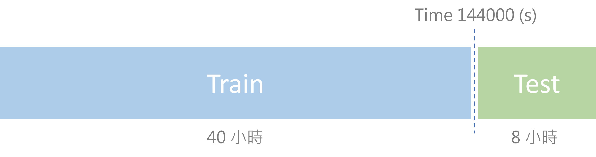
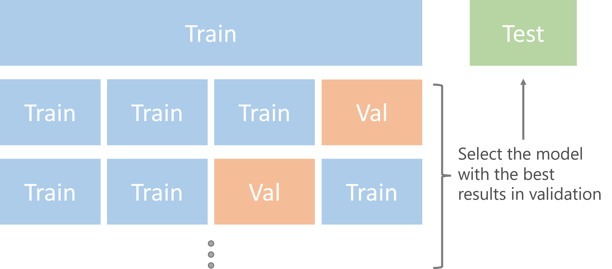

# [Group8] Credit Card Fraud Detection
#### Tags: `Imbalanced data`、`Binary classification`、`Finance`、`Transaction data`

### Groups
* 何彥南, 110753202
* 陳偉瑄, 110971020
* 葉又瑄, 108304046
* 鮑蕾雅, 108304017
* 林佑彥,	108304015

## Goal

- 資料來源: [Credit Card Fraud Detection](https://www.kaggle.com/mlg-ulb/creditcardfraud)
- 該資料集包含兩天的信用卡交易紀錄資料，包含以下特徵28個 PCA 特徵(V1 ~ V28)、交易額(Amount)、時間(Time)，預測目標為**是否為詐欺交易(Class)**。
- 因為詐欺交易本來就是數量較少，資料呈現**極度不平衡**狀態。
- 目標是由前面 **40 小時** 的資料(train)預測後面  **8 小時**發生的詐欺交易(test)

### Training and testing data set



### K-fold methon


### Demo 
可以參考 `code/2_baseline.R`，有使用 R 的 rpart(決策樹) 作為預測模型，並在我們定義 kfold(`output/1_kfold/kfold_idx.rds`) 終測試模型穩定度，其中包含 maxdepth、minsplpit 參數測試的實驗流程

## Folder organization and its related information

### docs
* Your presentation, 1101_datascience_FP_<yourID|groupName>.ppt/pptx/pdf, by **Jan. 13**
* 包含開會紀錄、工作進度

### data 
- `train.csv`
  - 取前 40 小時的資料 (Time 欄位 < 144000)
  - 共 224865 筆資料
  - 目標欄位 Class 比例: 0.001846 
- `test.csv` :
  - 取後 8 小時的資料 (Time 欄位 >= 144000)
  - 共 59942 筆資料
  - 目標欄位 Class 比例: 0.001285 

### code

* Which method do you use?
* What is a null model for comparison?
* How do your perform evaluation? ie. cross-validation, or addtional indepedent data set

### results
* Which metric do you use 
  * precision, recall, R-square
* Is your improvement significant?
* What is the challenge part of your project?

## References
- _Tommy Huang, 機器學習: Ensemble learning之Bagging、Boosting和AdaBoost, 2018, medium. ([source](https://chih-sheng-huang821.medium.com/%E6%A9%9F%E5%99%A8%E5%AD%B8%E7%BF%92-ensemble-learning%E4%B9%8Bbagging-boosting%E5%92%8Cadaboost-af031229ebc3))_
- _Tatiana Sennikova, How to Build a Baseline Model,  2020, medium. ([source](https://towardsdatascience.com/how-to-build-a-baseline-model-be6ce42389fc))_
- _Google, Classification on imbalanced data, 2021,  Tensorflow tutorials. ([source](https://www.tensorflow.org/tutorials/structured_data/imbalanced_data))_
- _Google, Validation Set: Another Partition, 2020, google developers(Machine Learning Crash Course). ([source](https://developers.google.com/machine-learning/crash-course/validation/another-partition))_

## environment
- `./docs/sessionInfo(yen-nan ho).txt`
```
R version 3.6.3 (2020-02-29)
Platform: x86_64-w64-mingw32/x64 (64-bit)
Running under: Windows 10 x64 (build 19043)

Matrix products: default

locale:
[1] LC_COLLATE=Chinese (Traditional)_Taiwan.950 
[2] LC_CTYPE=Chinese (Traditional)_Taiwan.950   
[3] LC_MONETARY=Chinese (Traditional)_Taiwan.950
[4] LC_NUMERIC=C                                
[5] LC_TIME=Chinese (Traditional)_Taiwan.950    

attached base packages:
[1] stats     graphics  grDevices utils     datasets  methods  
[7] base     

other attached packages:
[1] tidyr_1.1.3      lattice_0.20-38  rpart_4.1-15    
[4] ica_1.0-2        corrplot_0.92    factoextra_1.0.7
[7] ggplot2_3.3.5    ranger_0.12.1   

loaded via a namespace (and not attached):
 [1] tidyselect_1.1.1 purrr_0.3.4      carData_3.0-4   
 [4] colorspace_2.0-1 vctrs_0.3.8      generics_0.1.1  
 [7] utf8_1.2.1       rlang_0.4.11     ggpubr_0.4.0    
[10] pillar_1.6.2     glue_1.4.2       withr_2.4.2     
[13] DBI_1.1.1        foreach_1.5.1    lifecycle_1.0.0 
[16] plyr_1.8.6       munsell_0.5.0    ggsignif_0.6.3  
[19] gtable_0.3.0     codetools_0.2-16 labeling_0.4.2  
[22] fansi_0.4.2      broom_0.7.10     Rcpp_1.0.6      
[25] readr_1.4.0      backports_1.2.1  scales_1.1.1    
[28] abind_1.4-5      farver_2.1.0     hms_1.1.1       
[31] digest_0.6.27    rstatix_0.7.0    dplyr_1.0.6     
[34] ggrepel_0.9.1    grid_3.6.3       cli_2.5.0       
[37] tools_3.6.3      magrittr_2.0.1   tibble_3.1.1    
[40] crayon_1.4.1     car_3.0-12       pkgconfig_2.0.3 
[43] ellipsis_0.3.2   MASS_7.3-51.5    Matrix_1.2-18   
[46] assertthat_0.2.1 rstudioapi_0.13  iterators_1.0.13
[49] R6_2.5.1         nlme_3.1-144     compiler_3.6.3  

```
